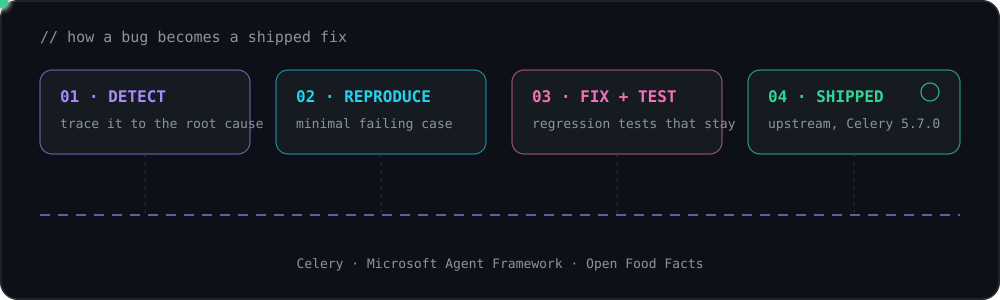
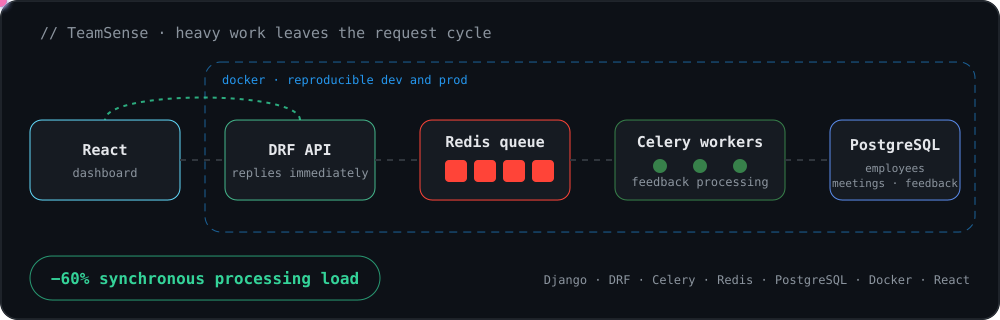
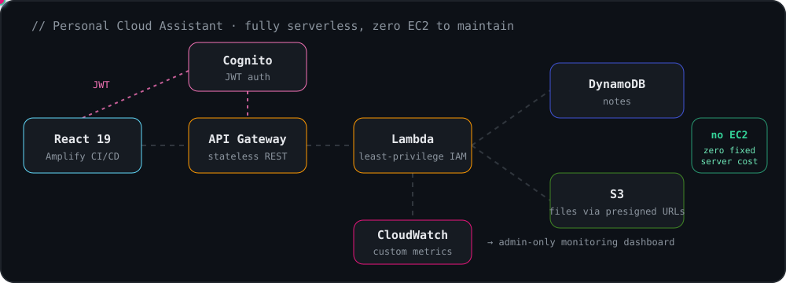

<div align="center">



<br/>

[](https://www.linkedin.com/in/namraa-patel/)
[](https://namraa310806.github.io/Portfolio/)
[](https://leetcode.com/u/patelnamraa/)
[](https://codeforces.com/)
[](mailto:patelnamraa88@gmail.com)


</div>

<!-- UPDATE: replace https://codeforces.com/ above with https://codeforces.com/profile/<your-handle> -->

---

## `> choose your path`

<details>
<summary><b>🧑‍💼 I'm a recruiter. Give me 20 seconds.</b></summary>

<br/>

- **Looking for:** Summer 2027 SDE / Backend / ML internships
- **Proof of work:** fixes merged into **Celery** and **Microsoft Agent Framework**, plus Open Food Facts
- **Competitions:** JPMorgan Chase Code for Good 2026 winner · Amazon ML Challenge 2025 top 2,500 of 30,000+ · Codeforces Expert (1731) · LeetCode 2207
- **Industry:** Django backend intern, cut average API response time by **25%** under production load
- **Contact:** [patelnamraa88@gmail.com](mailto:patelnamraa88@gmail.com)

</details>

<details>
<summary><b>🛠️ I'm an engineer. Show me the hard stuff.</b></summary>

<br/>

Scroll to the **bug autopsies** section. Two of them are animated: a reference-cycle memory leak and a re-entrant lock deadlock, both in Celery.

</details>

<details>
<summary><b>🔧 I'm a maintainer. Will this person waste my time?</b></summary>

<br/>

Every PR below comes with a root cause, a minimal reproduction where it applies, and regression tests. In one review I flagged an uncovered edge case in my own fix before anyone asked. My first open source PR took 9 commits to merge, and I treat review feedback as the point, not an obstacle.

</details>

---

## `> what I actually do`

<div align="center">

</div>

I don't just add features to open source. I go looking for the bugs that hide in **concurrency, memory and shared state**, trace them to the exact line, and fix them with tests that make sure they never come back.

<div align="center">

| 🐛 **5** upstream fixes | 🧬 **5** different bug classes | 🏷️ **3** in Celery **5.7.0** | 🧪 **0** fixes without tests |
|:---:|:---:|:---:|:---:|

</div>

---

## `> the pipeline`

<div align="center">

</div>

---

## `> 🔬 bug autopsies`

Watch the bug happen, then watch the fix. Each animation loops: **broken first, fixed second**.

<div align="center">

### Autopsy #1 · the leak that could not be freed



### Autopsy #2 · a thread that waits on itself



</div>

### The full case files

<details>
<summary><b>🧬 celery#10461</b> · shared-state mutation in <code>autoretry_for</code></summary>

<br/>

| | |
|:---|:---|
| **Bug class** | Shared mutable state |
| **Symptom** | State leaking between task retries |
| **Root cause** | A mutable default `retry_kwargs` dict was aliased across retries |
| **Fix** | Minimal reproduction first, then the fix |
| **Review** | Flagged an uncovered edge case in the `getattr` fallback branch |
| **Link** | [celery/celery#10461](https://github.com/celery/celery/pull/10461) |

</details>

<details>
<summary><b>🧬 celery#10493</b> · memory leak on the hard-timeout path</summary>

<br/>

| | |
|:---|:---|
| **Bug class** | Reference cycle / memory leak |
| **Root cause** | `traceback_clear(exc)` was silently failing because it targeted a frame still on the call stack |
| **Fix** | Removed the dead call and set `exc.__traceback__ = None` to break the exception, traceback, frame cycle |
| **Proof** | Regression test plus a hard-timeout smoke test |
| **Status** | Merged, **5.7.0** milestone |
| **Link** | [celery/celery#10493](https://github.com/celery/celery/pull/10493) |

</details>

<details>
<summary><b>🧬 celery#10497</b> · re-entrant lock deadlock in the Redis result backend</summary>

<br/>

| | |
|:---|:---|
| **Bug class** | Deadlock / re-entrancy |
| **Root cause** | A redundant `UNSUBSCRIBE` could re-enter redis-py's non-reentrant PubSub lock |
| **Fix** | Guarded the redundant call |
| **Proof** | Regression tests |
| **Status** | Merged, **5.7.0** |
| **Link** | [celery/celery#10497](https://github.com/celery/celery/pull/10497) |

</details>

<details>
<summary><b>🧬 celery#10510</b> · certificate expires mid-run, still passes</summary>

<br/>

| | |
|:---|:---|
| **Bug class** | Time-of-use gap (security) |
| **Root cause** | A certificate could expire mid-run and still pass signature checks |
| **Fix** | Explicit expiry check ahead of verification |
| **Proof** | Regression tests |
| **Status** | Merged, **5.7.0** |
| **Link** | [celery/celery#10510](https://github.com/celery/celery/pull/10510) |

</details>

<details>
<summary><b>🧬 agent-framework#7901</b> · <code>from_dict()</code> mutates the caller's input</summary>

<br/>

| | |
|:---|:---|
| **Bug class** | Unintended input mutation |
| **Root cause** | `SerializationMixin.from_dict()` updated nested dictionaries in the caller's input in place when merging dictionary-shaped dependencies |
| **Fix** | Replaced in-place updates with non-mutating merges |
| **Proof** | Regression tests |
| **Status** | Merged |
| **Link** | [microsoft/agent-framework#7901](https://github.com/microsoft/agent-framework/pull/7901) |

</details>

Also merged: a keyboard-navigable crop handles accessibility fix in [Open Food Facts Explorer](https://github.com/openfoodfacts/openfoodfacts-explorer/pull/1225), after full review. <!-- UPDATE: add your confirmed GSSoC 2026 rank / PR count here -->

---

## `> things I've built`

Four projects. Two of them have live architecture diagrams, so you can watch the data move.

<div align="center">

| ⚡ **−60%** synchronous processing load (TeamSense) | 🚀 **−25%** average API response time (Django internship) | ☁️ **0** EC2 instances (Personal Cloud Assistant) |
|:---:|:---:|:---:|

</div>

### 🧠 [TeamSense](https://github.com/Namraa310806/TeamSense) · async HR analytics pipeline

<div align="center">

</div>

HR teams work across fragmented tools. TeamSense ingests employee data and surfaces it on one dashboard. Compute-heavy feedback processing runs in a **Celery + Redis** pipeline instead of the request cycle, which cut synchronous processing load by **60%**. Multi-entity **PostgreSQL** schema for employees, meetings and feedback, containerized with **Docker**.

`Django` `DRF` `Celery` `Redis` `PostgreSQL` `Docker` `React`

---

### ☁️ [Personal Cloud Assistant](https://github.com/Namraa310806/AWSPeronsalCloudAssistant) · serverless on AWS · [live demo](https://main.d1xrjjt0e3swym.amplifyapp.com)

<div align="center">

</div>

Notes and file management with no servers to maintain. Stateless **Lambda + API Gateway** backend, **DynamoDB** for notes, **S3** with presigned URLs for files, **Cognito** JWT auth with **least-privilege IAM**, custom **CloudWatch** metrics (operation counts, request duration, errors) behind an admin-only dashboard, and a **React 19** frontend deployed through Amplify CI/CD.

`Lambda` `API Gateway` `DynamoDB` `S3` `Cognito` `CloudWatch` `React`

---

<table>
<tr>
<td width="50%" valign="top">

### 🎓 [ProfiLens](https://github.com/Namraa310806/ProfiLens)
**Career-prep platform**

Roadmap, exam, certificate, resume, in one flow. Normalized, indexed **PostgreSQL** schema for user progress and gamification data, which reduced read latency on high-frequency endpoints. **RBAC** with session-scoped permissions, plus a background ReportLab pipeline for certificate and resume generation.

`Django` `DRF` `PostgreSQL` `ReportLab`

</td>
<td width="50%" valign="top">

### 🎨 [Color Classifier](https://github.com/Namraa310806/ColorClassifierML)
**ML web app** · [live demo](https://namraapatel-colorclassifier.streamlit.app/)

Random Forest on a custom-labeled color dataset, with image patching and OpenCV histogram features, served as a live Streamlit app with distribution charts. Full pipeline from raw image to classified, visualized output.

`Python` `scikit-learn` `OpenCV` `NumPy` `Streamlit`

</td>
</tr>
</table>

---

## `> arsenal`

Every logo below is a real logo with its name written under it, and all of them live inside one file in this repo.

<div align="center">

</div>

---

## `> scoreboard`

<div align="center">

</div>

<details>
<summary><b>📋 Prefer it as a table?</b></summary>

<br/>

| | Achievement |
|:---:|:---|
| 🥇 | **JPMorgan Chase Code for Good 2026**, winner, production-ready solution for a nonprofit partner |
| 🏆 | **Open Source Hackathon**, winner, production-ready features under time pressure |
| 🤖 | **Amazon ML Challenge 2025**, top 2,500 of 30,000+ |
| 🔎 | **Google The Big Code 2026**, qualified for Round 2 |
| 🏁 | **Hackout 2025**, finalist |
| 🎓 | **Oracle Certified**, OCI Generative AI Professional + Data Science Professional |
| 🌍 | **GSSoC 2026**, nationally ranked open source contributor |
| 🔥 | **Codeforces Expert (1731)** · **LeetCode 2207** |
| 📚 | **PDEU B.Tech CSBS**, CGPA 9.46 / 10, graduating 2028 |

</details>

---

## `> status`

<div align="center">

| 🟢 **Contributing to** | 🎯 **Looking for** | 🎓 **Studying** |
|:---:|:---:|:---:|
| Celery · Microsoft Agent Framework · Open Food Facts | Summer 2027 SDE / Backend / ML internships | B.Tech CSBS at PDEU, graduating 2028 |

</div>

---

## `> activity`

<div align="center">


<br/><br/>

<picture>
  <source media="(prefers-color-scheme: dark)" srcset="https://raw.githubusercontent.com/Namraa310806/Namraa310806/output/github-snake-dark.svg" />
  <source media="(prefers-color-scheme: light)" srcset="https://raw.githubusercontent.com/Namraa310806/Namraa310806/output/github-snake.svg" />
  
</picture>

</div>

---

<div align="center">

<a href="mailto:patelnamraa88@gmail.com">
  
</a>

</div>

<br/>

<details>
<summary><b>🧨 please don't open this</b></summary>

<br/>

```python
Traceback (most recent call last):
  File "curiosity.py", line 1, in <module>
    raise CuriosityError("you opened the one thing marked 'do not open'")
CuriosityError: same energy that makes me read other people's stack traces for fun.

>>> hire(namraa, role="SDE / Backend / ML Intern", start="Summer 2027")
Offer sent to patelnamraa88@gmail.com
```

</details>

<br/>

<div align="center">

*"My first open-source PR took 9 commits to get merged. Every one of them taught me something."*


</div>
